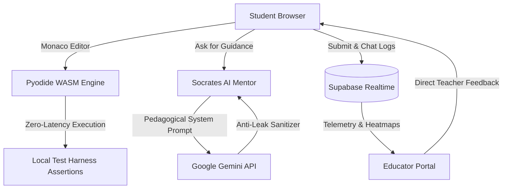

<div align="center">

# 🏛️ Socrates IDE
### *Empathy-Driven Socratic AI Coding Platform for Computer Science Education*

[](https://react.dev/)
[](https://www.typescriptlang.org/)
[](https://pyodide.org/)
[](https://ai.google.dev/)
[](https://tailwindcss.com/)
[](https://supabase.com/)

<br/>

[](https://socrates-web-beta.vercel.app/)
[](https://youtu.be/Ce-jjRcyxRY)

</div>

---

## 🌐 Live Interactive Deployment
Experience Socrates IDE directly in your browser:

👉 **[https://socrates-web-beta.vercel.app/](https://socrates-web-beta.vercel.app/)**

---

## 📺 5-Minute Prototype Pitch Video
Watch our full video presentation demonstrating the Student IDE, Pyodide WASM execution, Socratic AI dialogue, and the Educator Telemetry Portal:

🔗 **[Watch on YouTube: https://youtu.be/Ce-jjRcyxRY](https://youtu.be/Ce-jjRcyxRY)**

---

## 📌 The Problem: The AI Crutch in CS Education
With the rapid explosion of Generative AI tools (ChatGPT, Copilot), computer science students are increasingly copying and pasting AI-generated code rather than developing foundational problem-solving intuition. They pass automated homework checks, but fail fundamental technical interviews and conceptual exams.

### 💡 The Solution: Socratic AI & Empathy Telemetry
**Socrates IDE** replaces passive answer generation with active cognitive scaffolding. Instead of giving away direct code solutions:
1. **Socratic AI Mentor:** Diagnoses root conceptual misunderstandings (e.g. off-by-one loop boundaries, recursion flaws, or stack underflows) and asks targeted, bite-sized questions to guide the student.
2. **Local WebAssembly Python Runtime (Pyodide):** Executes student code instantly in-browser with zero remote server lag or cold starts.
3. **Educator Empathy Telemetry:** Gives professors real-time class heatmaps, tracking common student stumbling blocks and chronological dialogue replays.

---

## 🚀 Key Features

### 🧑‍🎓 1. Student Portal & In-Browser IDE
* **Local Pyodide WASM Runtime:** In-browser Python 3 execution with instant test assertions, zero queue wait times, and offline capabilities.
* **10 Curated DSA Problems:** Complete algorithmic curriculum covering Array Traversal, Linear Search, In-Place Reversal, Two Sum, Min/Max Search, Binary Search, Palindrome Check, Valid Parentheses Stack, Bubble Sort, and Remove Duplicates.
* **Ergonomic Keyboard Shortcuts:**
  * `Ctrl + Enter` $\rightarrow$ Run Code
  * `Ctrl + Shift + Enter` $\rightarrow$ Submit Solution
  * `Esc` $\rightarrow$ Close Socratic AI Chat
* **Big-O & Efficiency Analysis:** Instant feedback on runtime efficiency and automated assertion tests.

### 🦉 2. Socratic AI Mentor (Owl Mascot)
* **Never Spoils Code:** Adheres to strict pedagogical rules; guides thinking through analogies and mental models without writing solutions.
* **Google Gemini API with Native `system_instruction`:** Built-in anti-leak sanitizers strip out reasoning drafts and output pure, natural conversational dialogue.
* **Interactive Confidence Check-Ins:** Real-time feedback buttons (`👍 Yes` / `❓ Clarify`) allow the AI to adapt its explanations dynamically.
* **Draggable & Persistent Mascot:** Retains custom desktop docking positions across page reloads.

### 👨‍🏫 3. Educator Telemetry Portal
* **Class-Wide Misconception Heatmaps:** Aggregates real-time student stumbling blocks across course sections (CS-101 Data Structures, CS-102 Algorithms, Python Lab).
* **Section & Student Drill-Down:** Multi-level roster view with live AI score matrices and completion rates.
* **Chronological Socratic Replay:** Inspect any student's submitted code snapshots side-by-side with their complete AI debugging chat history.
* **Private Pedagogical Feedback:** Send personalized commendations or guidance directly to students with in-IDE notification banners.
* **Proctoring & Anomaly Queue:** Flags and manages integrity review signals (paste events, tab switches) with student self-appeal support.

---

## 🌟 Phase 2 Industry Review Implementation (GDTA Hackathon 2026)

In response to the Phase 2 Industry Evaluation by Gowtham Murugan, the following 8 priority capabilities have been engineered and verified:

1. **End-to-End Live Data Flow (Priority 1):**
   * Real-time student journey: Code attempt $\rightarrow$ Pyodide assertion check $\rightarrow$ Socratic guidance $\rightarrow$ Revision $\rightarrow$ Passing submission $\rightarrow$ Instant reflection in Educator Portal via Supabase Realtime channels.
2. **Automated n8n Alert Workflow (Priority 1):**
   * Production webhook (`https://edwin98.app.n8n.cloud/webhook/socrates-telemetry`) receives student telemetry, validates payloads, enforces intervention rules (AI score < 80 or syntax error), stores alerts into Supabase `instructor_alerts`, and dispatches email notifications.
   * Self-contained export available in `socrates_n8n_workflow.json`.
3. **Data Source Transparency (Priority 1):**
   * Educator portal includes an explicit `🟢 Live Cloud Sync (Supabase)` vs `🟡 Demo Mode (Local Fallback)` live status badge.
4. **Institutional Security & Key Architecture (Priority 2):**
   * Documented roadmap transitioning from client-side keys (MVP testing) to serverless Supabase Edge Functions with secret management and per-student rate limiting.
5. **Academic Integrity Review Signals & Self-Appeal (Priority 2):**
   * Replaced punitive locks with *Academic Integrity Signals for Instructor Review*.
   * Multi-threshold tab switch detection (3 switches $\rightarrow$ warning banner; 6 switches $\rightarrow$ flagged for review).
   * In-IDE self-appeal submission form allowing students to submit an explanation note and continue in Review Mode.
   * Educator queue displays student appeals with a 1-click "Review & Clear Flag" action.
6. **Authentication & Role Access (Priority 2):**
   * Login portal is badged with `Phase 2 Demo Mode` with 1-click credential switching between Student IDE and Educator Portal.
7. **Educator Direct Guidance & Custom Problem Test Harness (Priority 2):**
   * Database-persisted teacher feedback delivered live to the student's IDE with a "Discuss with Socrates" action.
   * Teacher-created custom problems execute dynamic Python assertion harnesses in Pyodide with zero default or fake passes.
8. **Comprehensive DSA Edge-Case Test Suites (Priority 3):**
   * Added exhaustive boundary testing across all curriculum problems (1.2.1–1.2.10):
     * **Valid Palindrome (1.2.7):** `"Madam, I'm Adam"`, mixed-case sentences, single chars, and empty strings.
     * **Valid Parentheses (1.2.8):** Interleaved brackets `([)]`, unclosed `(((`, and empty inputs.
     * **Binary Search (1.2.6):** Empty arrays, boundary targets (first & last), missing elements.
     * **Two Sum (1.2.4):** Duplicate elements (`[3, 3], target=6`), and no-solution cases.
     * **Array Reversal & Display (1.2.1–1.2.3):** Single-element, empty array, and exact string output checks.

---

## 🏗️ System Architecture



---

## 📁 Repository Structure

```text
SOCRATES-IDE/
├── socrates-web/                   # Main Frontend Application
│   ├── src/
│   │   ├── components/
│   │   │   ├── StudentIDE.tsx      # Monaco IDE + 10 DSA Curriculum + Test Harness
│   │   │   ├── SocraticChat.tsx    # Draggable Socratic AI Chat + Owl Mascot
│   │   │   ├── TeacherDashboard.tsx# Educator Portal + Heatmaps + Dialogue Replay
│   │   │   ├── CodeEditor.tsx      # Monaco Editor wrapper with anti-paste proctoring
│   │   │   ├── ExecutionPanel.tsx  # Bottom slide-up terminal & Big-O analyzer
│   │   │   ├── AISettingsModal.tsx # Gemini API Key & model configuration
│   │   │   └── ProblemCreatorModal.tsx # Teacher custom problem authoring
│   │   ├── lib/
│   │   │   ├── gemini.ts           # Gemini API client + Socratic prompt sanitizer
│   │   │   └── supabaseClient.ts   # Supabase backend client
│   │   ├── App.tsx                 # Dual Portal Router & Modern Login Screen
│   │   └── main.tsx                # Application Entrypoint
│   ├── package.json                # Project dependencies
│   └── vite.config.ts              # Vite configuration
├── socrates_pitch_thumbnail.jpg    # 16:9 HD Pitch Thumbnail
├── PRD.md                          # Product Requirements Document
├── README.md                       # Project Documentation
└── .gitignore                      # Git exclusion rules
```

---

## ⚡ Quick Start Guide

### Prerequisites
* **Node.js**: v18.0 or higher
* **npm** or **yarn** / **pnpm**

### Installation

1. **Clone the repository:**
   ```bash
   git clone https://github.com/your-username/socrates-ide.git
   cd socrates-ide/socrates-web
   ```

2. **Install dependencies:**
   ```bash
   npm install
   ```

3. **Configure Environment Variables (Optional):**
   ```bash
   cp .env.example .env
   ```
   *(You can also configure your Gemini API Key directly within the UI via the `⚙️ Settings` modal!)*

4. **Start the local development server:**
   ```bash
   npm run dev
   ```

5. **Open in browser:**
   Navigate to **[http://localhost:5173](http://localhost:5173)** to explore Socrates IDE!

---

## 🧪 Demo Credentials (One-Click Launch)
The platform includes quick 1-click demo launch buttons on the login screen:
* **🧑‍🎓 Student Portal:** Click `⚡ Launch Student IDE` (Username: `demo student`)
* **👨‍🏫 Educator Portal:** Click `⚡ Launch Educator Portal` (Username: `demo teacher`)

---

## 👥 Authors & Acknowledgments
Built with ❤️ for empowering the next generation of computer scientists through empathetic, Socratic AI pair programming.

* **Demo Video:** [https://youtu.be/Ce-jjRcyxRY](https://youtu.be/Ce-jjRcyxRY)
* **License:** MIT License
